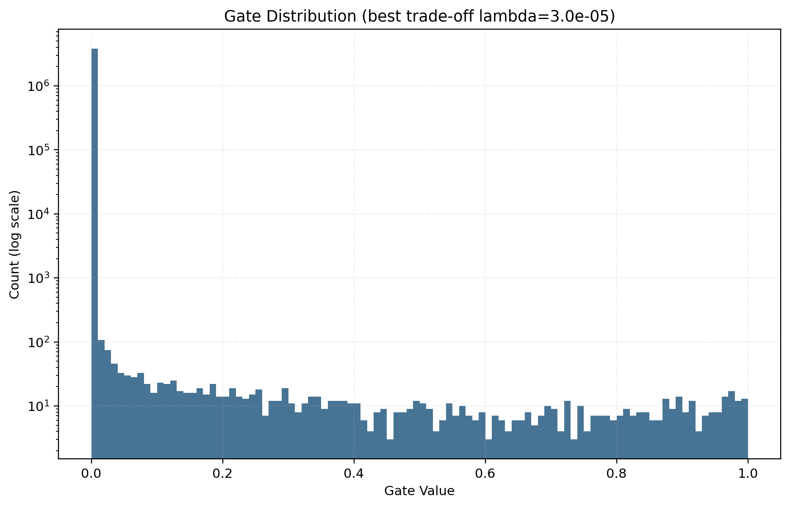
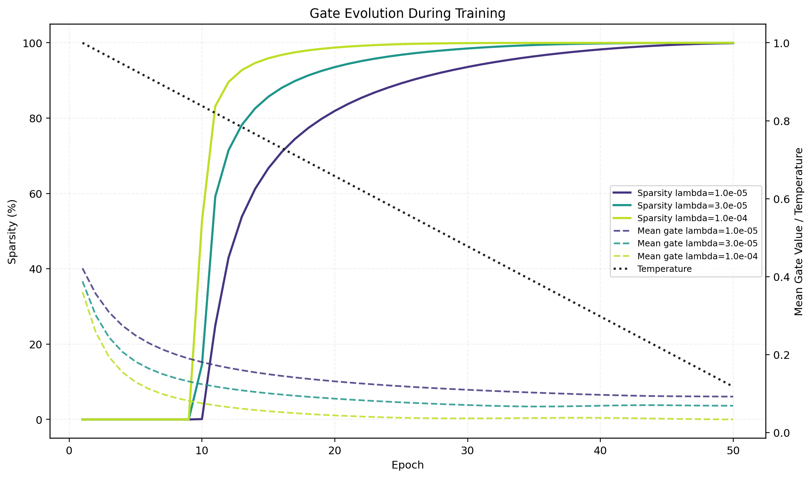
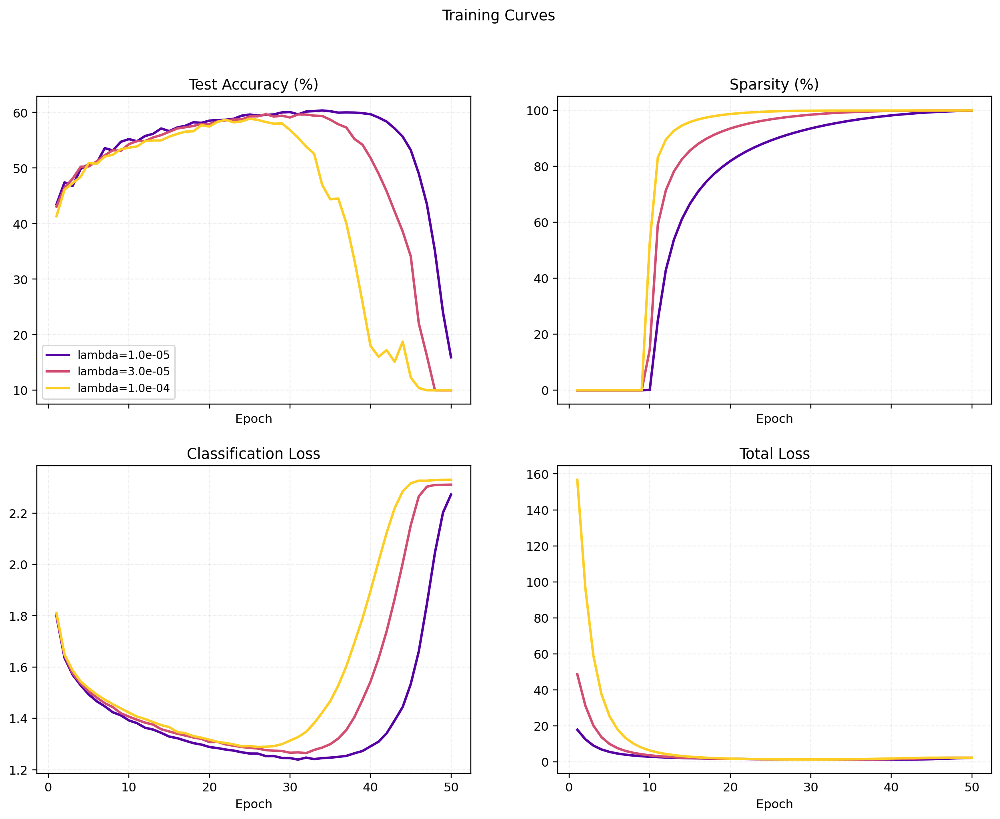
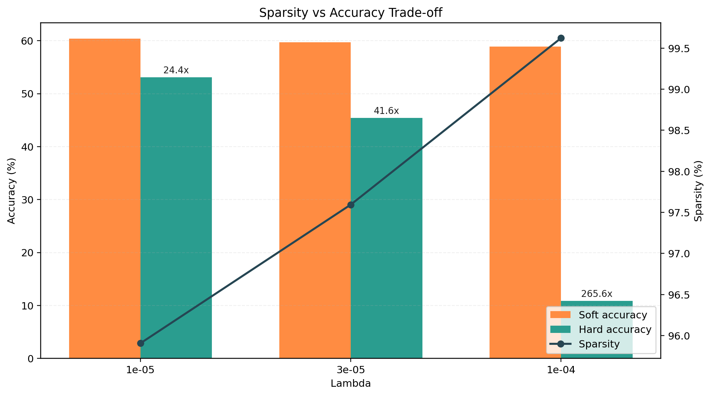

# Self-Pruning Neural Network - Report

## 1. Why L1 Penalty on Sigmoid Gates Encourages Sparsity
The sparsity term applies an L1 penalty to activated gates, so each gate receives a consistent downward pressure while still being bounded in (0, 1) by sigmoid. Gates tied to less useful connections usually cannot justify staying open through classification gradients, so they are pushed near zero. Temperature annealing further sharpens decisions late in training, making the final gate distribution more bimodal and easier to hard-prune.

## 2. Results

### Run Configuration
- Seed: `42`
- Epochs: `50`
- Sparsity threshold: `1e-2`
- Device: `Kaggle Tesla T4 GPU`
- Command:

```bash
python self_pruning_network.py --mode train --epochs 50 --lambdas "1e-5,3e-5,1e-4" --gate-lr-multiplier 2 --output-dir . --report-filename report.md
```

### Best vs Final Epoch Summary
| Lambda (λ) | Best Epoch | Best Test Acc (%) | Best Sparsity (%) | Final Test Acc (%) | Final Sparsity (%) |
|:---|---:|---:|---:|---:|---:|
| 1e-05 | 34 | 60.36 | 95.91 | 15.94 | 99.88 |
| 3e-05 | 27 | 59.69 | 97.59 | 10.00 | 99.96 |
| 1e-04 | 25 | 58.88 | 99.62 | 10.00 | 99.98 |

### Case-Study Spec Table (Lambda | Test Accuracy | Sparsity Level %)
| Lambda (λ) | Test Accuracy (%) | Sparsity Level (%) |
|:---|---:|---:|
| 1e-05 | 60.36 | 95.91 |
| 3e-05 | 59.69 | 97.59 |
| 1e-04 | 58.88 | 99.62 |

Note: The table above reports **best-epoch** test accuracy and sparsity for each lambda to represent the pruning-accuracy trade-off before late-stage over-pruning collapse.

### Hard Pruning Results
| Lambda (λ) | Soft Accuracy at Best Epoch (%) | Hard Accuracy (%) | Compression Ratio |
|:---|:---:|:---:|:---:|
| 1e-05 | 60.36 | 53.09 | 24.43x |
| 3e-05 | 59.69 | 45.41 | 41.58x |
| 1e-04 | 58.88 | 10.86 | 265.56x |

### Per-Layer Sparsity Breakdown
| Lambda (λ) | layer_1 | layer_2 | layer_3 | layer_4 |
|:---|:---:|:---:|:---:|:---:|
| 1e-05 | 98.56% | 86.91% | 69.91% | 2.38% |
| 3e-05 | 99.24% | 92.53% | 80.03% | 8.52% |
| 1e-04 | 99.92% | 99.11% | 95.86% | 27.15% |

### Parameter Reduction Summary
| Lambda (λ) | Total Parameters | Active Parameters | Compression Ratio | FLOPs Reduction (%) |
|:---|---:|---:|---:|---:|
| 1e-05 | 3803648 | 155701 | 24.43x | 95.91 |
| 3e-05 | 3803648 | 91487 | 41.58x | 97.59 |
| 1e-04 | 3803648 | 14323 | 265.56x | 99.62 |

### Analysis
Two valid selections emerge based on objective: **1e-05** is the best practical operating point for accuracy-sensitive deployment (hard-pruned accuracy **53.09%** at **95.91%** sparsity), while **3e-05** is the stronger compression-focused point (**97.59%** sparsity, **41.58x** compression) with lower hard-pruned accuracy (**45.41%**). Overall, increasing lambda improves sparsity/compression but eventually over-prunes the model and degrades accuracy.

## 3. Gate Distribution


## 4. Gate Evolution During Training


## 5. Training Dynamics


## 6. Sparsity vs Accuracy Trade-off

